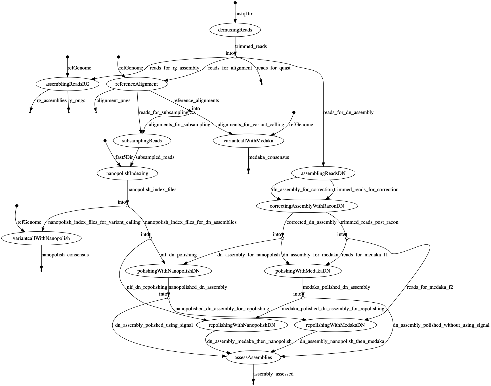

<div align="center">
    <h3>SIGNAL CHECK</h3>
    <hr>
    <a href="https://travis-ci.org/will-rowe/signal-check"></a>
    <a href="https://www.nextflow.io"></a>
    <a href=""></a>
</div>

***

## Overview

This is a long read assembly pipeline and set of workbooks for checking the usefulness of signal-data (for viral metagenomics); helping to decide if/where to keep it.

### Pipeline

There is one nextflow pipeline for both reference-guided and de-novo long read genome assembly, as well as a variant call-> consensus approach.

* demux and trim basecalled reads with qcat
* reference alignment and variant call
  * align with minimap2
  * variant call with signal (nanopolish)
  * variant call without signal (medaka)
* reference guided assembly
  * uses pomoxis (minimap2/miniasm/racon)
* de novo assembly
  * assembles with either miniasm or redbean
  * corrects with racon
* polishing  
  * optional read subsampling with pomoxis (subsampling used for nanopolish only)
  * without signal (medaka)
  * with signal (nanopolish)
  * with signal first, then without (nanopolish -> medaka)
  * without signal first, then with (medaka -> nanopolish)
* basic assessment
  * quast
  * depth plots

### Workbooks

[1.data-wrangling-and-assembly-pipeline](1.data-wrangling-and-assembly-pipeline.ipynb)

* download both the reference and experimental data
* run the assembly pipeline on basecalled data (guppy fast model)
* run the assembly pipeline on basecalled data (guppy high accuracy model)
* sanity check the results against RefSeq

[2.evaluating-mayinga-assemblies](2.evaluating-mayinga-assemblies.ipynb)

* compute consensus identity
* determine structural and nucleotide differences
* visualise alignments


### Data

We use data from the latest [artic data release](http://artic.network/protocol_validation_2019.html). In particular, the Ebola virus (EBOV) minion run that sequenced 3 strains of the virus (Mayinga, Kikwit, Makona) using the metagenomic protocol and rapid PCR kit.

## Running the analysis

* create and activate the conda environment for the notebook:
  
```
conda env create -f pipelines/environments/notebook-analysis.yaml 
conda activate notebook-analysis
```

* open the first notebook:

```
jupyter notebook 1.data-wrangling-and-assembly-pipeline.ipynb
```

## Standalone running of the pipeline

If you have nextflow and conda installed, you just need:

```
nextflow run pipelines/long-read-assembly-pipeline.nf --fastqDir </path/to/fastq_pass> --fast5Dir <path/to/fast5_pass> --refGenome <path/to/refGenome> --barcode 09 --output <output directory> -profile conda --cpus 6 --mem 12GB
```

> to run using Docker instead, swap the `-profile` over to docker

> refGenome is a multifasta of reference genomes, where each fasta header must be prefixed with `barcode-XX---` (e.g. >barcode-09---genomeA) to map the ref to sample

## Pipeline dags

### de novo long read assembly pipeline



## Todo

### pipeline todos
* add in help message and full param descript
* add in pre-run checks for reads, ref genome etc.
* Redbean assemblies aren't great, I need to try parameterising this better
* add in subsampling variations for pomoxis
* add in some qcat parameters (e.g. read length, Q score), and summarise qcat output
* output all intermediatery files via debug flag

### analysis todos
* run Nipah data from ARTIC release
* run the synthetic genome
* try with amplocon data - may not assemble
  * try using the align trim script of Nick's (which soft masks the bam)
  * add in checks for run-through chimeras (check double barcodes)
* colour snps in MSA viewer
* filter coverage for nucfdiff - e.g. only check differences in areas where coverage > 50x

## Notes

* medaka renames the contigs to include range data, which then breaks Nanopolish - so all contigs are renamed sequentially and according to polishing tool used; making downstream processing easier


## Nanopolish

In the Mayinga data, it looks as though Nanopolish is preferring 2 minor alleles over the alleles called by medaka.

This is the case for both high accuracy and fast bascalled data.

The nextflow pipeline processes which produce the result in question are: `polishingWithNanopolishDN` and `repolishingWithNanopolishDN`. The output of these processes has been kept in the repo:

> pipelines/data/pipeline-results/mayinga/r941_min_fast/debug


The commands used during `polishingWithNanopolishDN`:

```
minimap2 -ax map-ont -t ${task.cpus} ${assembly} ${reads} | samtools sort -o ${reads.getBaseName()}.assembly-alignment.bam -

samtools index ${reads.getBaseName()}.assembly-alignment.bam

nanopolish_makerange.py ${assembly} | parallel --results nanopolish.results -P ${task.cpus} nanopolish variants --consensus -o polished.{1}.vcf -w {1} -r ${reads} -b ${reads.getBaseName()}.assembly-alignment.bam -g "${assembly}" -t 4 --min-candidate-frequency 0.1

nanopolish vcf2fasta --skip-checks -g ${assembly} polished.*.vcf > assembly.fasta

awk '/^>/{print ">dn|racon.nanopolish|contig" ++i; next}{print}' < assembly.fasta > ${assembly.getSimpleName()}.dn-assembly.racon.nanopolish.fasta
```