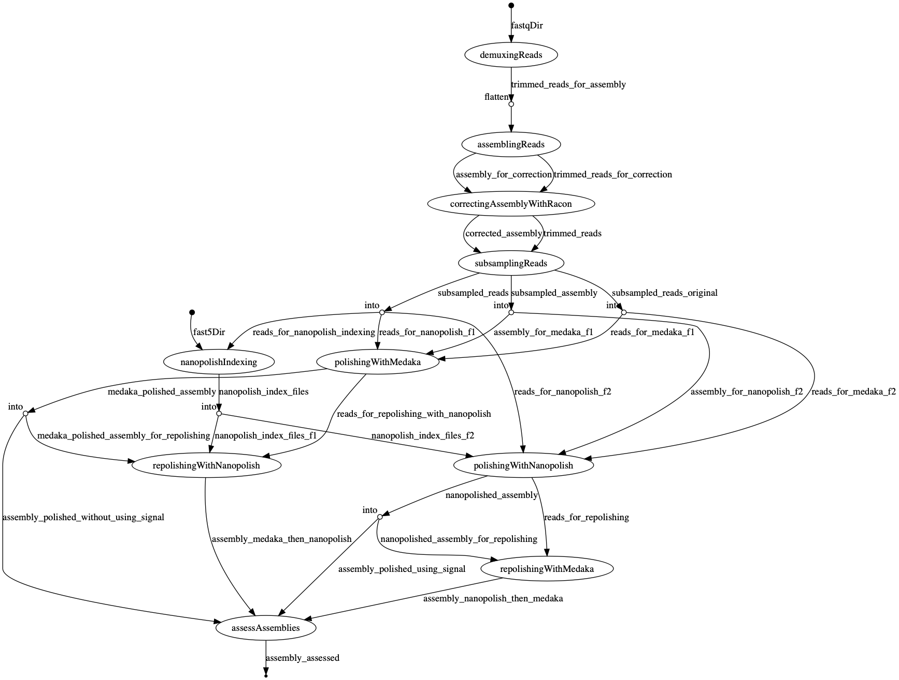

<div align="center">
    <h3>SIGNAL CHECK</h3>
    <hr>
    <a href="https://travis-ci.org/will-rowe/signal-check"></a>
    <a href="https://www.nextflow.io"></a>
    <a href=""></a>
</div>

***

## Overview

This is a long read assembly pipeline and set of workbooks for checking the usefulness of signal-data (for viral metagenomics); helping to decide if/where to keep it.

### pipeline

There is one nextflow pipeline for both reference-guided and de-novo long read genome assembly.

* demux and trim basecalled reads with qcat
* reference guided assembly
  * uses pomoxis (minimap2/miniasm/racon)
* de novo assembly
  * assembles with either miniasm or redbean
  * corrects with racon
* polishing  
  * optional read subsampling with pomoxis (subsampling used for nanopolish only)
  * without signal (medaka)
  * with signal (nanopolish)
  * with signal first, then without (nanopolish -> medaka)
  * without signal first, then with (medaka -> nanopolish)
* basic assessment
  * quast
  * depth plots

### workbooks

[1.data-wrangling-and-pipelines](1.data-wrangling-and-pipelines.ipynb)

* download both the reference and experimental data
* run the assembly pipeline on basecalled data (guppy fast model)
* run the assembly pipeline on basecalled data (guppy high accuracy model)
* sanity check the results against RefSeq

[2.evaluating-mayinga-assemblies](2.evaluating-mayinga-assemblies.ipynb)

* compute consensus identity
* determine structural and nucleotide differences
* visualise alignments


### data

We use data from the latest [artic data release](http://artic.network/protocol_validation_2019.html). In particular, the Ebola virus (EBOV) minion run that sequenced 3 strains of the virus (Mayinga, Kikwit, Makona) using the metagenomic protocol and rapid PCR kit.

## Running the analysis

* create and activate the conda environment for the notebook:
  
```
conda env create -f pipelines/environments/notebook-analysis.yaml 
conda activate notebook-analysis
```

* open the first notebook:

```
jupyter notebook 1.data-wrangling-and-pipelines.ipynb
```

## Standalone running of the pipeline

If you have nextflow and conda installed, you just need:

```
nextflow run pipelines/long-read-assembly-pipeline.nf --fastqDir </path/to/fastq_pass> --fast5Dir <path/to/fast5_pass> --refGenome <path/to/ref> --barcodes 09,10,11 --output <output directory> -profile conda --cpus 6 --mem 12GB
```

> to run using Docker instead, swap the `-profile` over to docker

## Pipeline dags

### de novo long read assembly pipeline



## Todo

* add in help message and full param descript
* get more info from the qcat process (using the parsing script)
* add in pre-run checks for reads, ref genome etc.
* add pycoqc
* Redbean assemblies aren't great, I need to try parameterising this better


## Notes

* medaka renames the contigs to include range data, which then breaks Nanopolish - so contigs are renamed sequentially after medaka
 - actually, all contigs are now renamed according to polishing tool used - this makes downstream processing easier
